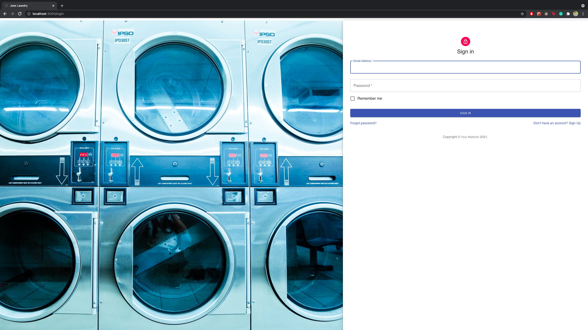
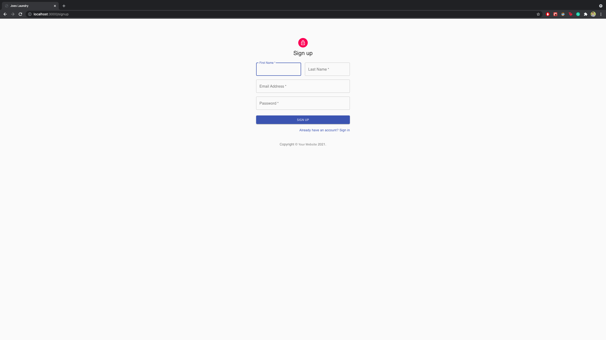
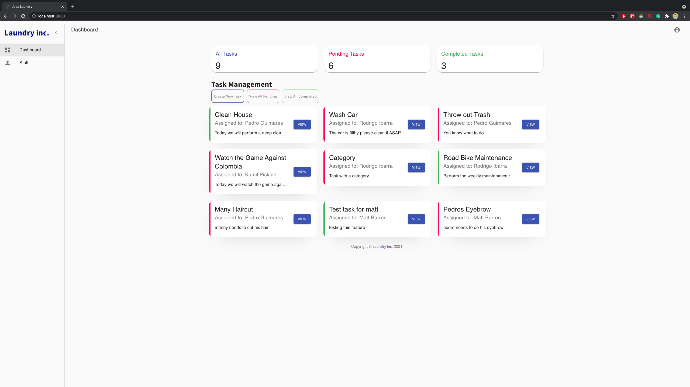
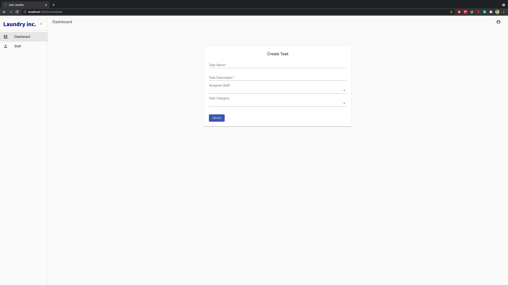
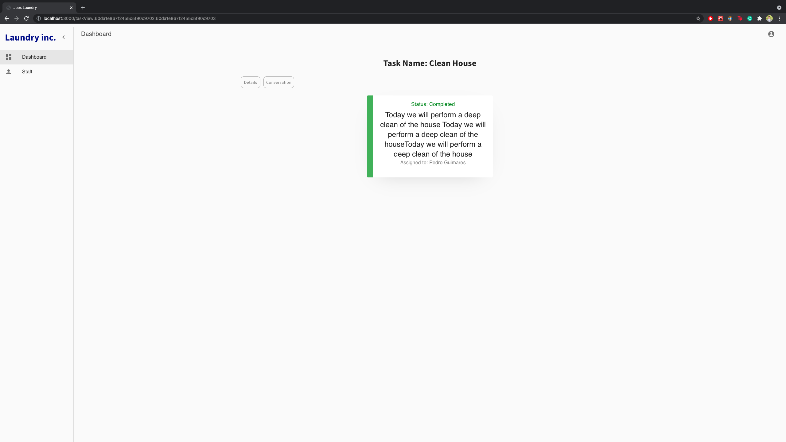
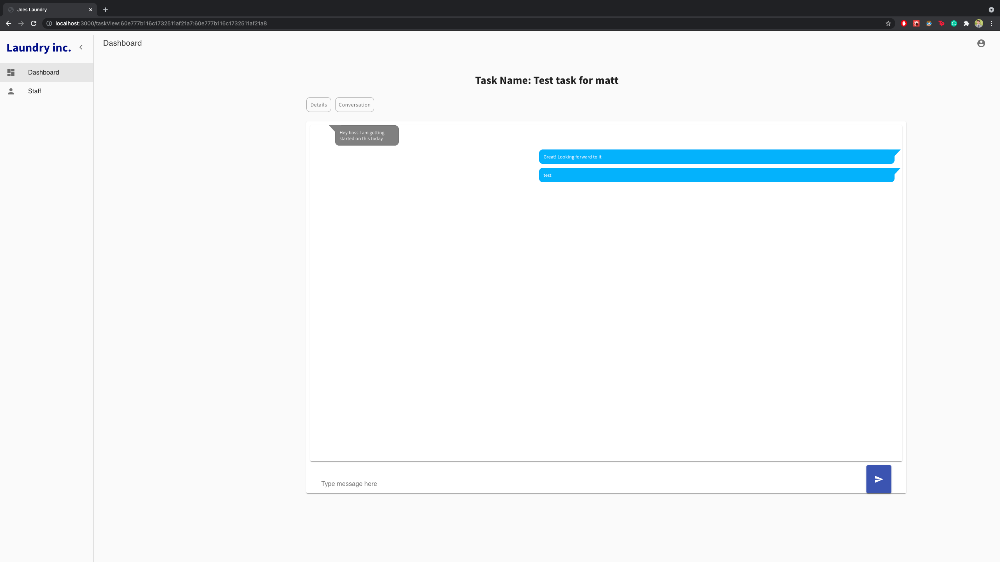
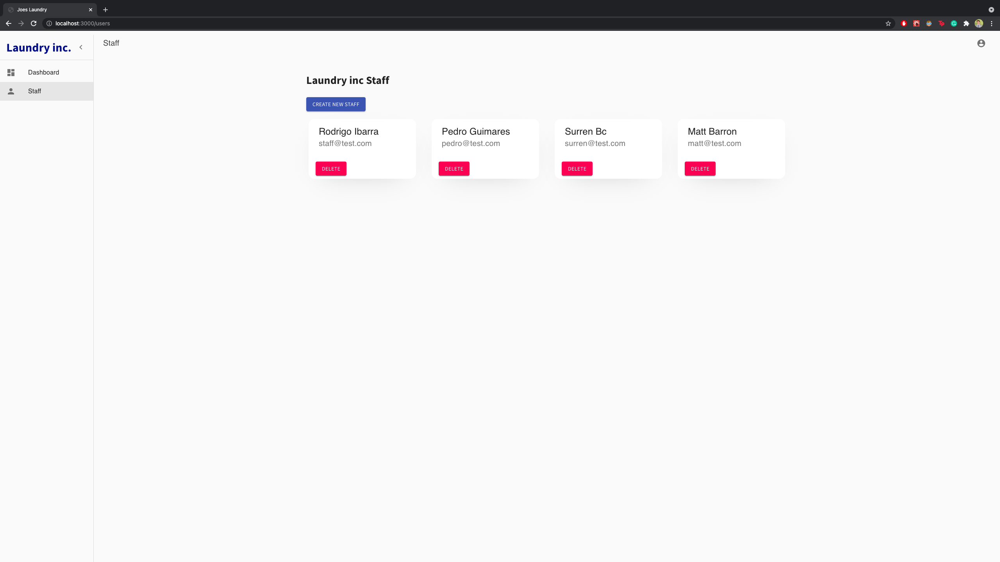

# Laundry inc Web App

This web app allows an "admin" user to create staff accounts, create tasks, and assign those tasks to a specific staff.

Through the web app, the admin can keep track of the progress of every task, and he/she can communicate with the staff based on the task. Every task has it's own conversation.

